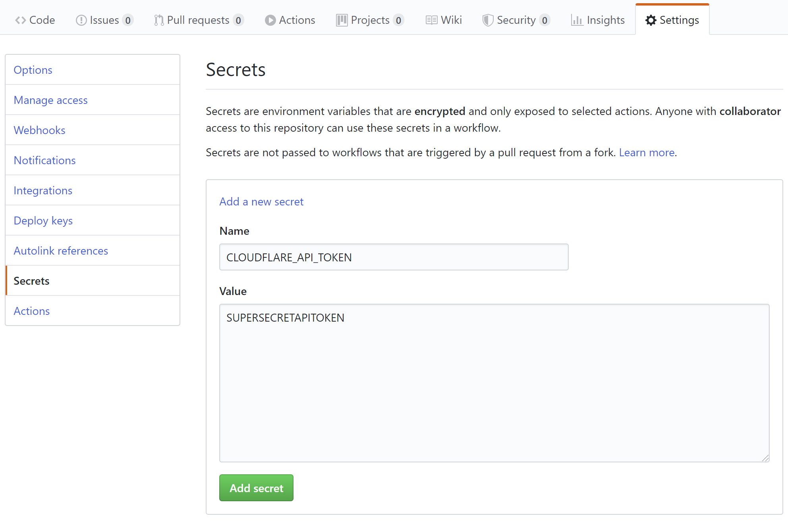
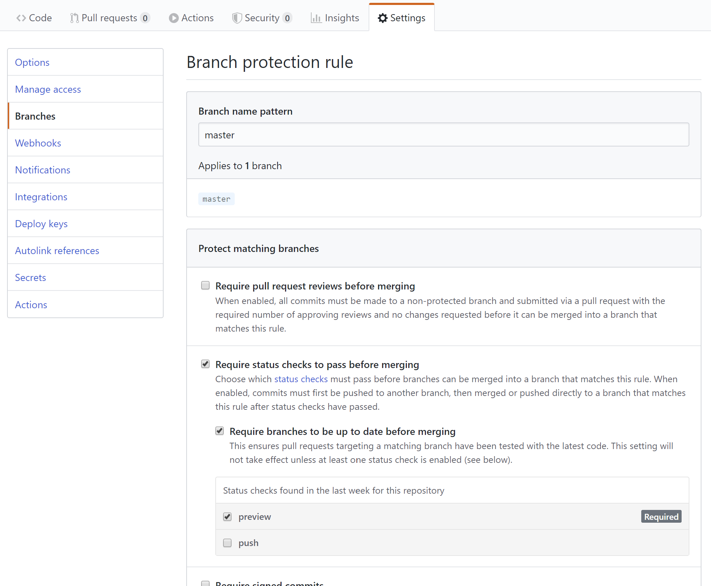

# dns-template

Template for GitHub Actions based DNS configuration with [DNSControl](https://stackexchange.github.io/dnscontrol/).

## Features

* Automatic deployment of DNS configuration on merge to master.
* Automatic previews of DNS configuration changes in pull requests to master.
* JavaScript based declarative configuration with DNSControl.

## How to set up

1. Fork this repository.

2. Update `dnsconfig.js` with your configuration (see [dnsconfig.js reference](https://stackexchange.github.io/dnscontrol/js)).

3. Configure providers:

    * For CloudFlare, just [create an API token](https://dash.cloudflare.com/profile/api-tokens) with the `Zone:Zone:Read` and `Zone:DNS:Edit` permissions,
      and add it as a secret named `CLOUDFLARE_API_TOKEN` in your repository settings.
    * For other providers, generate credentials for your provider, add a secret with a name of your choice,
      and reference that secret in `creds.json`, `.github/workflows/dns_preview.yml` and `.github/workflows/dns_push.yml`.

4. Set up branch protections for the `master` branch:

    * You probably want to require the `preview` job to complete before a PR can be merged.
    * If you have multiple contributors, you may want to set up required pull request reviews or
      code owners for your repository.

5. Profit!